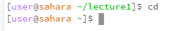
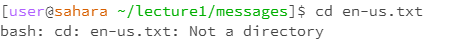
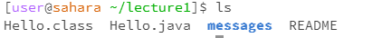
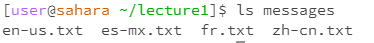
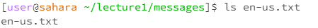
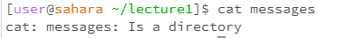

# Lab 1 Report
**Felix Xie**

**AO3 CSE 15L**
## cd Without Any Arguments

* The working directory when the code was run was /home/lecture1.
* There was no output. However, the working directory was changed to the home directory, and this is because using the cd command without any arguments returns you back to the home directory.
* This is not an error.

## cd With a Directory as an Argument

* The working directory when the code was run was the home directory, or /home.
* There was no output. However, the working directory was changed to /home/lecture1, and this is because the cd command when given a directory as an argument navigates to the directory passed as an argument.
* This is not an error.

## cd With a File as an Argument

* The working directory when the code was run was /home/lecture1/messages
* The output was the message "bash: cd: en-us.txt: Not a directory". This was received as an output because the cd argument cannot accept a file as an argument.
* This is an error, as the cd command navigates through directories only, not files, and therefore passing a file as an argument results in an error. 

## ls Without Any Arguments

* The working directory when the code was run was /home/lecture1.
* The output was a list of files and folders: Hello.class, Hello.java, messages, and README. This specific output was received because those files and folders were in the lecture1 folder, and the ls command's intended purposed when used without any arguments is used to view contents inside the current directory.
* This is not an error. 

## ls With a Directory as an Argument

* The working directory when the code was run was /home/lecture1.
* The output was a list of files and folders: en-us.txt, es-mx.txt, fr.txt, zh-cn.txt. This specific output was received because those files and folders were in the messages folder, and the ls command's intended purpose when passed with a directory as an argument displays the contents of the directory passed as an argument.
* This is not an error.

## ls With a File as an Argument

* The working directory when the code was run was /home/lecture1/messages.
* The output was the same file passed as the argument, en-us.txt. This is because the only file that is inside the en-us.txt file is itself.
* This is not an error.
  
## cat Without Any Arguments

* The working directory when the code was run was the home directory.
* There was no output. However, the terminal stalled, and required a signal interrupt to return back to normal because no arguments were passed/no file was given to be printed.
* This is an error, as the cat function reads and attempts to print the contents of a file, and therefore, without an argument/file to read, will stall. 

## cat With a Directory as an Argument

* The working directory when the code was run was /home/lecture1.
* The output was "cat: messages: Is a directory". This output is received because the messages directory is a directory and has nothing to be printed.
* This is an error, as the cat command prints the contents of a file, and since a directory is not a file, throws an error. 

## cat With a File as an Argument

* The working directory when the code was run was /home/lecture1/messages.
* The output received was "Hello World!", and this output was received because the contents of the en-us.txt file, which was passed as an argument, contains the line "Hello World!", which was then printed as a result of the cat command.
* This is not an error. 
