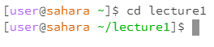
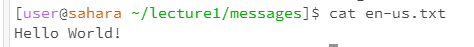

# Lab 1 Report
**Felix Xie**

**October 9** 

**CSE 15L**

## cd Without Any Arguments

* The

## cd With a Directory as an Argument

## cd With a File as an Argument

## ls Without Any Arguments

## ls With a Directory as an Argument

## ls With a File as an Argument

## cat Without Any Arguments

## cat With a Directory as an Argument

## cat With a File as an Argument

