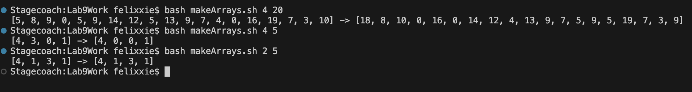

# Lab 5 Report
**Felix Xie**

**AO3 CSE 15L**
## Part 1 - Context
### File & Directory Structure

The following file/directory structure is required to run this scenario:

```
Lab9Report/
  makeArrays.sh
  SortArrayByParity.java
```

Note: The files `outputFile.txt` and `SortArrayByParity.class` will be created as a result of running `bash makeArrays.sh`

### Content of Files Before Fixes

The following image shows the content of the `SortArrayByParity.java`:


Intended purpose of `SortArrayByParity.java`: `SortArrayByParity.java`'s main method takes one argument, an integer. An array of the specified size of integers from 0 (inclusive) to the specified value (exclusive) are then populated as the values in the array. Then, the array is sorted by parity, where the even numbers appear in the front and the odd numbers appear in the end. For example, if the call was `java SortArrayByParity 5`, an array of size 5 where any value can be any integer in the range [0, 4] would be generated. Then, the even numbers would be pushed to the front of the array, and the odd numbers to the back. If there were 3 even numbers, then the first 3 numbers of the sorted array would be even (any order works). 


The following image shows the content of the `makeArrays.sh`:


Intended purpose of `makeArrays.sh`: `makeArrays.sh` takes two arguments, the first being the number of arrays to be created, and the second is the size of the arrays to be created. The file will generate the specified number of arrays unsorted to sorted, and write them all out to outputFile.txt, as well as print the result into the terminal. For example, if the call was `bash makeArrays.sh 5 5`, then 5 arrays should be generated of length 5, and the unsorted and sorted version of each array should be added to the file `outputFile.txt` (one pair of unsorted to sorted per line), and these contents should be printed in the terminal as well. 

## Part 2 - Student's Initial Post
### Date: November 30th, 2023 | Name: Bonga Bunga | Title: My code doesn't function properly
Whenever I try to run my code, it fails. I tried running these 3 inputs:
```
bash makeArrays.sh 4 20
bash makeArrays.sh 4 5
bash makeArrays.sh 2 5
```
And the code does not function properly. Here's a screenshot for when I run it:

### Symptom


### Guess of the bug
I can see that there is only 1 array being created when there should be more, and there's only one array being created no matter how many arrays should be created. This means there is probably some bug in how the arrays are being written to the file. The other issue is that the array that is created is one less than the expected size. This is probably due to an error in creating each array, as the sorting proccess seems to work just fine. 
