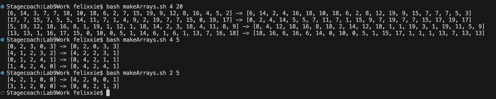

# Lab 5 Report
**Felix Xie**

**AO3 CSE 15L**
## Part 1 - Context
### File & Directory Structure

The following file/directory structure is required to run this scenario:

```
Lab9Report/
  makeArrays.sh
  SortArrayByParity.java
```

Note: The files `outputFile.txt` and `SortArrayByParity.class` will be created as a result of running `bash makeArrays.sh`

### Content of Files Before Fixes

The following image shows the content of the `SortArrayByParity.java`:


Intended purpose of `SortArrayByParity.java`: `SortArrayByParity.java`'s main method takes one argument, an integer, henceforth known as n. An array of the size n is created, and is populated with integers of values ranging from 0 (inclusive) to n (exclusive). Then, the array is sorted by parity, where the even numbers appear in the front and the odd numbers appear in the end. For example, if the call was `java SortArrayByParity 5`, an array of size 5 where any value can be any integer in the range [0, 4] would be generated. Then, the even numbers would be pushed to the front of the array, and the odd numbers to the back. If there were 3 even numbers, then the first 3 numbers of the sorted array would be even (any order works), and the last 2 odd (any order works). 

The following image shows the content of the `makeArrays.sh`:


Intended purpose of `makeArrays.sh`: `makeArrays.sh` takes two arguments, the first being the number of arrays to be created, and the second the input for integer n to be passed to `SortArrayByParity.java`. The file creates the total number of arrays specified in the first argument under the conditions specified by the second argument, sorts them, and writes the unsorted and sorted versions of all the arrays to outputFile.txt, and then prints the result into the terminal. For example, if the call was `bash makeArrays.sh 5 5`, then 5 arrays should be generated of length 5, and the unsorted and sorted version of each array should be added to the file `outputFile.txt` (one pair of unsorted and corresponding sorted array per line), and these contents should be printed in the terminal as well. 

## Part 2 - Student's Initial Post
### Date: November 29th, 2023 | Name: Bonga Bunga | Title: My code doesn't function properly
Whenever I try to run my code, it fails. I tried running these 3 inputs:
```
bash makeArrays.sh 4 20
bash makeArrays.sh 4 5
bash makeArrays.sh 2 5
```
And the code does not function properly. Here's a screenshot for when I run it:

### Symptom


### Guess of the bug
I can see that there is only 1 array being created when there should be more, and there's only one array being created no matter how many arrays should be created. This means there is probably some bug in how the arrays are being written to the file. The other issue is that the array that is created is one less than the expected size. This is probably due to an error in creating each array, as the sorting proccess seems to work just fine. 

## Part 3 - TA's Response
### Date: November 30th, 2023 | Name: Mois T'Chiken | Re: My code doesn't function properly
You're on the right track on both points! I would suggest you consider the looking up the difference between the two commands `>>` and `>` when writing to `outputFile.txt` in `makeArrays.sh`. Both are very similar and have a subtle difference, which may be the key to solving your problem with the total number of arrays being written to `outputFile.txt` and thus being printed out.

Since you are created an array of a size one less than what is expected, there is most likely an off-by-one error in one of your loops when you handle generating/printing your array. I would go back and check each one of your loops thoroughly to make sure that there is no off-by-one error.

## Part 3 - Student's Follow-up and Changes
### Date: November 31th, 2023 | Name: Bonga Bunga | Re: My code doesn't function properly
Thank you! It seems to have done the trick! I searched up the difference between the two commands you suggested as well as looked through my loops, and changed `>` to `>>` in line 10 of `makeArrays.sh` and I also caught an off-by-one error in my `toString()` method in `SortArrayByParity.java`. After making those changes, my code seems to work perfectly now! Here's the output after running the same three commands before:
```
bash makeArrays.sh 4 20
bash makeArrays.sh 4 5
bash makeArrays.sh 2 5
```


